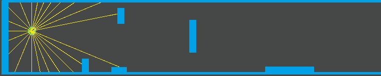

# Genetic Neural Network
Unity project about genetically🧬 selected neural networks

## GIFs because why not

 
First Generation

 
20 seconds later

 
45 seconds later

 
7 minutes later

 
12 minutes later

## What is this project
Made on free time, it is an experimentation on Neural Networks and Genetic Algorithms.
Long story short: The little guys "evolve" to navigate the map

## How to use it?
Download Unity and clone/download the repo and open the project! You'll see a single scene that can be used as is or changed.
It contains the following:
* SCRIPTS: General information and options to control the Population.
  * On MazeBuilder
    * Map number - Defines both the map to be built and the save file to be used when saving
    * Maze Parent - Parent object for the maps to keep things organized
    * Select the Map Number you want and click "Build"    
  * ⏸Pause Condition - If you want to pause the simulation at specific points
  * 🔃Load Save File - Loads a specific save file on Play. Agents will be copied based on the NN saved on the file of this index (set it to -1 to ignore)
  * 💾Save On Better Fitness - If an `Agent` achieves a better fitness than the one saved, its NN will be saved overwriting the old one
  * Auto Select First Agent - Helps with visualization
  * Number Of Agents - Used both to create agents and maps
  * Input, hidden and output nodes - Input nodes are adjusted automatically to changes on the `Agent`. Hidden nodes can be altered at will (breaks saves)
  * Agent mutation rate - Chance of each agent to be mutated, when creating a new generation
  * Neuron mutation rate - Chance of each node to be mutated, if the agent was selected for mutation
  * Mutation amount - How much the value of the node will be mutated
  * Procreation percentage - How many of a new generation should be created from mating, instead of randomly
  * Randomize starting heights - If the starting heights of the agents should be random
  * Starting height - Used if the above condition is false
  * Original Agent - Acts as a prefab, but should be left on the scene and will be deactivated on Play
  * Agent Parent: Parent object for the agents to keep things organized

## Goals
I will be updating this for easy of usage and clarity when possible. Making it easily costumizable and simple to use are the goals, so it can be used in a variety of different games and experiments.
